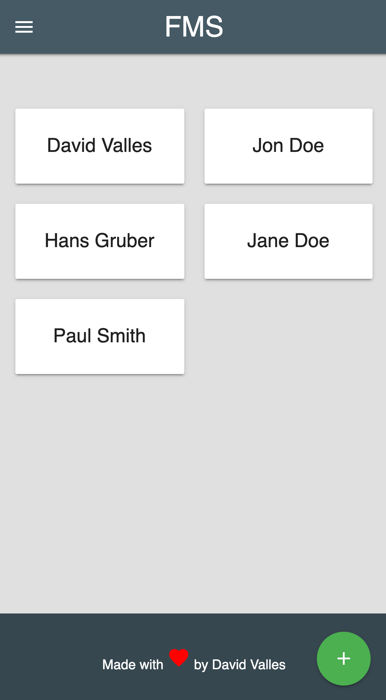

# FMS-WSK

A web app to capture [FMS](https://functionalmovement.com) assessment scores.

## Live

Navigate to [https://fms-wsk.firebaseapp.com](https://fms-wsk.firebaseapp.com) to see the application.

## Tech Stack

This app is based on [Web Starter Kit](https://github.com/google/web-starter-kit). However, I integrated [Materialize Sass](http://materializecss.com/) instead of [Material Design Lite](https://getmdl.io/).

## Development

Use the following build commands to get things done!

### gulp serve

Builds, serves and watches files for development.

### gulp serve:dist

Builds and serves production distribution.

> All of a sudden sh?t did not work when I did this. No explanation - very frustrating!

### gulp

Builds production distribution. 

## Deployment

This project is deployed to [Firebase](https://firebase.google.com/). To begin, create an app at [Firebase Console](https://firebase.google.com/console).

Then follow the instructions at [Web Starter Kit - Deploy to Firebase](https://github.com/google/web-starter-kit/blob/master/docs/deploy-firebase.md) to install, initialize and deploy the application.

## Disclaimer

**This application is for personal use and education only. It is not an official application of, nor endorsed or supported by [FMS](https://functionalmovement.com).**

## License

[Apache Software License 2.0](http://www.apache.org/licenses/LICENSE-2.0.html).
